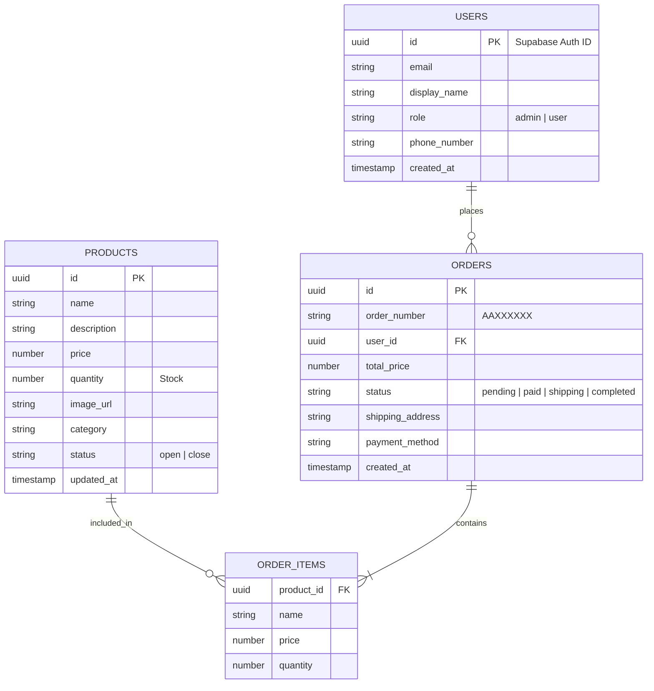
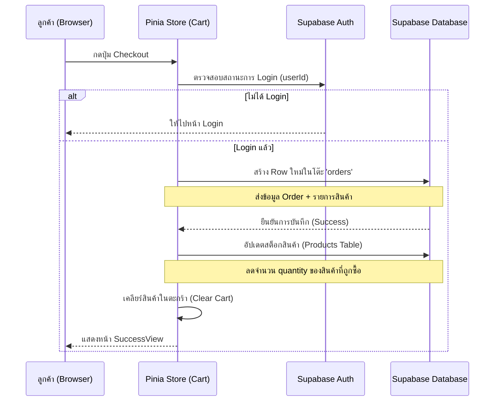
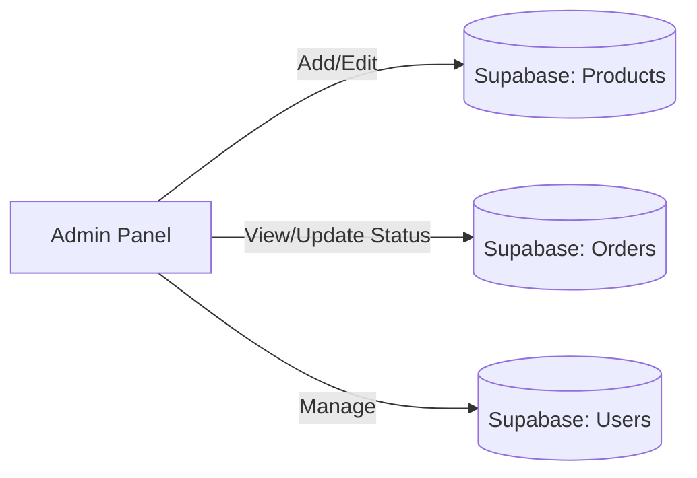

# Database Design & Data Flow - ez-com

ไฟล์นี้แสดงโครงสร้างฐานข้อมูล (ER Diagram) และขั้นตอนการไหลของข้อมูล (Data Flow) ระหว่างหน้าบ้านและหลังบ้าน (Supabase)

---

## 1. Database Schema (ER Diagram)
แผนผังโครงสร้างของ Supabase Tables และความสัมพันธ์ของข้อมูล

---

## 2. Data Flow (Frontend to Backend)
ขั้นตอนการส่งข้อมูลเมื่อมีการสั่งซื้อสินค้า

---

## 3. Admin Flow (Management)
ขั้นตอนการจัดการสินค้าของ Admin

---

### วิธีการดูไฟล์นี้ให้เห็นเป็นรูปภาพ:
1. หากคุณใช้ **VS Code**: ให้กดปุ่ม `Ctrl + Shift + V` เพื่อเปิด Preview ของ Markdown
2. คุณจะเห็นแผนผังแบบ Visual ที่สวยงามครับ
